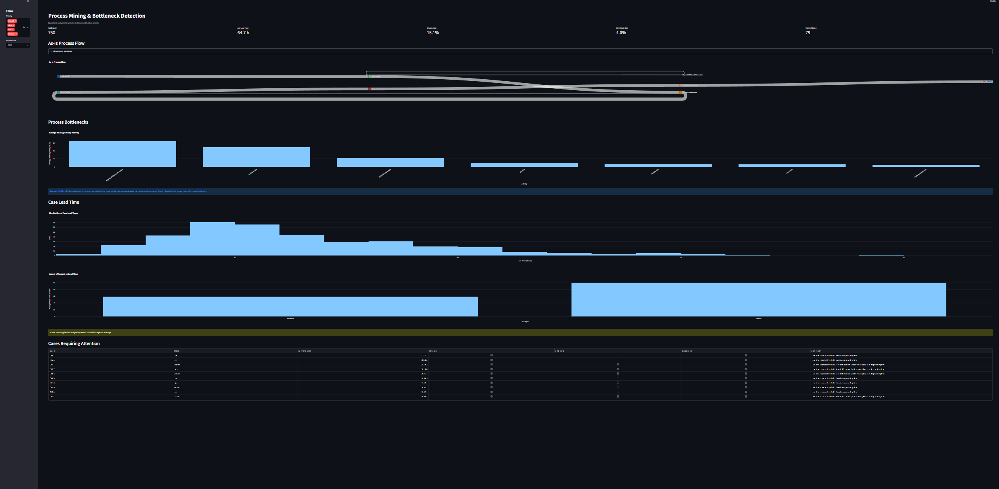
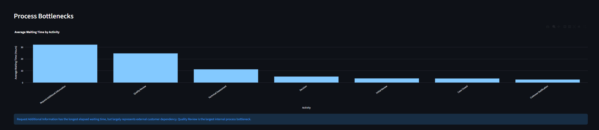
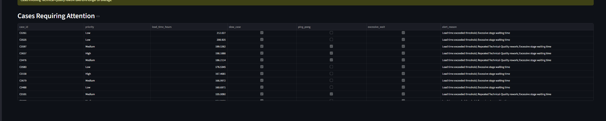

# Process Mining & Bottleneck Detection

An end-to-end process analytics project that reconstructs a customer quality-claim process from event-log data, identifies operational bottlenecks and rework patterns, and evaluates a proposed To-Be process redesign.

The project combines **Python, PostgreSQL, PM4Py, Plotly, Streamlit, Docker, and Pytest** to demonstrate how event data can be transformed into actionable process-improvement insights.

## Project Overview

The simulated business process represents customer quality claims moving through Customer Service, Technical, and Quality teams.

A synthetic event log containing **750 cases and 5,834 events** was generated with realistic operational behavior, including:

- different case priorities;
- missing-information loops;
- Technical–Quality rework;
- repeated ping-pong behavior;
- variable stage waiting times;
- abnormal delays.

Rather than analyzing the intended workflow, the project reconstructs the **actual As-Is process from observed event sequences**.

## Architecture

```text
Synthetic Event Log
        |
        v
   PostgreSQL
        |
        v
Data Validation & Transformation
        |
        +-------------------+
        |                   |
        v                   v
Custom Analytics          PM4Py
        |                   |
        |                   +-- Directly-Follows Graph
        |                   +-- Process Variants
        |
        +-- Lead Time
        +-- Waiting Time
        +-- Rework
        +-- Ping-Pong Detection
        +-- Bottleneck Detection
        +-- Operational Alerts
        |
        v
Streamlit Dashboard
        |
        v
As-Is Process Diagnosis
        |
        v
To-Be Process Redesign
        |
        v
Improvement Scenario

## Dashboard Overview



### Bottleneck & Rework Analysis



### Operational Case Monitoring

